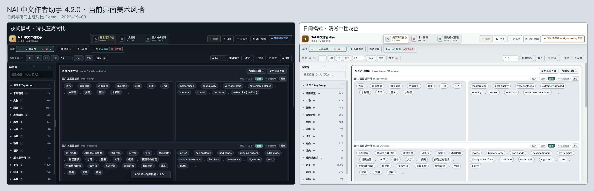
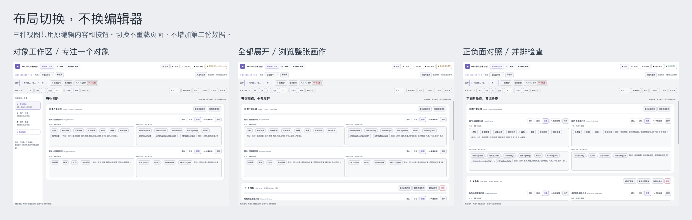

# NAI 中文作者助手

**面向 NovelAI 创作流程的本地优先中英双语提示词桌面工具。** 通过中文检索、Tag 整理、权重编辑、本地语义推荐、角色与分镜管理等功能，让提示词编写和复用更顺手。

> 本仓库仅用于发布安装包、界面预览和更新说明，**不包含应用源码**。



## 主要功能

- **中英双语 Tag 编辑**：可使用英文 Tag、中文名称和常见别名进行检索。
- **大型本地标签库**：当前包含 258,525 条 Tag，并提供角色、画师、Tag Group、Wiki 说明和关联推荐。
- **洁珐 · 本地语义推荐**：输入自然中文描述或短语，在本机匹配可能需要的 Tag；核心语义推荐无需上传输入内容。它不会自动修改提示词，用户可逐项查看、勾选和导入推荐结果。
- **胶囊与文本双模式**：兼顾可视化编辑和长文本整理，支持正面、负面、角色及 `panel N:` 分镜内容。
- **权重与批量处理**：支持 `{}`、`[]`、数字权重、去权、批量导入、整理排序和中英文对应编辑。
- **预设与创作管理**：支持通用、角色、画师及自定义 Tag Group 预设，并提供画作、角色、分镜和个人画廊管理。
- **图片格式管理**：可查看或清理 NovelAI、A1111、ComfyUI PNG 元数据，并进行 PNG/JPG 转换。
- **可选 AI 辅助撰写**：可连接用户自行配置的 OpenAI-compatible API，生成中文描述及 NovelAI 提示词。
- **NovelAI 连环复制**：整理当前画作的复制顺序并打开官网，由用户在悬浮窗中逐项手动复制。
- **七种界面风格**：蓝灰工作室、紧凑专业版、暖纸创作台、侧栏工具台、正负面对照板、居中写作台和对象工作区；每种风格提供适合自身的专属配色，并支持日间/夜间模式。



## 洁珐是什么

洁珐是软件内置的本地语义推荐助手，适合处理“知道自己想表达什么，但不确定应该使用哪些英文 Tag”的情况。比如输入“黄昏城市里的火焰少女”，它会尝试从描述中识别场景、人物、光线和视觉特征等概念，并在推荐栏中提供可选择的 Tag。

洁珐与普通搜索互补：普通搜索适合查找明确的英文 Tag、中文名称、别名、角色或画师；洁珐适合从自然中文短语中寻找相关候选；关联推荐则适合在已有 Tag 的基础上补充常见共现项。所有结果都需要用户自行判断，洁珐不会未经确认直接覆盖已有提示词。

洁珐不等同于“AI 辅助撰写”：它不需要 API Key，核心查询在本机完成；AI 辅助撰写则是独立功能，只有用户主动配置并调用 OpenAI-compatible API 时才会联网。洁珐也不会自动登录 NovelAI、填写官网、点击生成或消耗点数。

建议先输入较短的自然描述，等待推荐栏更新，再逐项查看中文说明、勾选并导入需要的 Tag。连续输入时软件会优先保证输入流畅，窗口进入后台后会降低高耗资源工作。

详细说明、使用示例、隐私边界、性能机制和常见问题请参阅：[《洁珐详细介绍》](docs/jiefa.md)。

### 洁珐语义理解盲测 Demo

如果想先了解洁珐如何从中文描述中整理 Tag，可以打开：[洁珐 vs DS 语义检索盲测](docs/demos/jiefa-ds-blind-test.html)，也可以直接使用：[在线体验盲测 Demo](https://yueyu8277-blip.github.io/NAI-Chinese-Author-Assistant-Releases/demos/jiefa-ds-blind-test.html)。

Demo 中的 DS 是“某tag 搜索工具”的简称。测试会随机抽取 10 个匿名化案例，先隐藏两套结果的来源，再由体验者根据 Tag 与句子的贴合程度进行选择；完成后才显示来源。该 Demo 用于展示交互方式和典型使用场景，不代表总体准确率，也不连接本机洁珐服务或上传输入内容。

## 下载与安装

请在仓库右侧的 **Releases** 页面下载与设备匹配的安装包。不要同时安装两个 macOS 架构版本。

| 系统 | 处理器 | 4.3.1 安装包 |
| --- | --- | --- |
| macOS | Apple M1 / M2 / M3 / M4 等 M 系列芯片 | `NAI-Author-Assistant-4.3.1-mac-arm64.dmg` |
| macOS | Intel 芯片 | `NAI-Author-Assistant-4.3.1-mac-x64.dmg` |
| Windows | 64 位 Intel / AMD | `NAI-Author-Assistant-4.3.1-win-x64-setup.exe` |

### 怎样确认 Mac 的处理器

打开屏幕左上角的 **Apple 菜单 → 关于本机**：

- 显示“芯片：Apple M…”时，下载 `mac-arm64.dmg`。
- 显示“处理器：Intel…”时，下载 `mac-x64.dmg`。

> Apple Silicon 原生 DMG 是 4.3.1 的一次性附加构建。后续版本是否继续提供，以对应版本的 Release 文件为准。

### macOS 安装

1. 打开下载的 DMG。
2. 将“NAI中文作者助手”拖入“应用程序”。
3. 首次打开若提示无法验证开发者，请前往 **系统设置 → 隐私与安全性**，确认文件来自本仓库后选择“仍要打开”。

当前 macOS 安装包未进行 Apple 开发者签名和公证，因此系统可能显示安全提示。请先核对下载来源和 SHA-256 校验值。

### Windows 安装

1. 运行 `NAI-Author-Assistant-4.3.1-win-x64-setup.exe`。
2. 按安装向导选择安装位置并完成安装。
3. 若 Microsoft Defender SmartScreen 提示“Windows 已保护你的电脑”，请确认文件来自本仓库，再选择“更多信息 → 仍要运行”。

当前 Windows 安装包未进行代码签名，因此可能显示发布者未知提示。

## 第一次使用

1. 首次启动会出现新手设置，可选择界面布局、专属配色、明暗模式，以及是否在语义模型就绪后自动开启洁珐。
2. 在任意提示词框输入中文、英文或别名，从推荐栏选择 Tag。
3. 可勾选多个结果后一次导入，也可以继续查看关联推荐。
4. 使用顶部权重工具调整当前 Tag，或切换胶囊/文本模式进行批量整理。
5. 常用内容可保存为预设；画作可按角色和分镜继续管理。
6. AI 辅助撰写为可选功能，只有在设置中填写自己的 API 信息并主动生成时才会联网。

教程和版本更新公告只会在相应安装/更新后的首次启动中自动出现。退出教程后，下次启动不会被强制重新带入；需要时可从设置中的“学习与帮助”再次打开。

在 macOS 上，**最小化窗口**会让软件继续运行，并在 Dock 中保持可见；**关闭最后一个窗口**会完整退出软件，不会留下不可见的 NAI 后台进程。

## 外观与布局

4.3.1 提供 A–G 七种布局风格。布局缩略图采用统一中性色，避免颜色影响对结构的判断；进入某种风格后，再选择该风格适配的专属配色。

布局、控件疏密和边框等结构性设置默认在安全重启后应用，以降低编辑中途切换造成显示异常或内容丢失的风险。主色和日间/夜间模式可直接预览。


## 数据与隐私

- 标签库、编辑器、画作资料和洁珐语义模型在本机运行。
- API Key 由 Electron `safeStorage` 交给系统安全存储保护，不写入工作区或浏览器本地存储。
- 使用统计仅保存在本机，不会自动上传。
- AI 辅助撰写只有在用户主动使用时，才会向用户配置的 API 服务发送本次请求所需内容。
- NovelAI 连环复制不会自动操作登录状态，不会自动填写官网、点击生成或消耗点数。
- 预设备份和普通导出文件是常规文件，不是加密保险库；请自行妥善保存可能包含私人创作内容的备份。

## 4.3.1 更新重点

- 重构教程启动、步骤切换和退出流程，降低教程卡死、卡顿、无法继续或无法退出的风险。
- 增加重试、跳过当前步骤和可靠退出，并在教程结束后恢复原工作区。
- 教程按新手、输入、编辑、创作、管理、外观、工具和更新分类，可检索并单独启动。
- 全新安装首次启动加入三步新手设置；已有用户升级不会被要求重新选择外观。
- 更新公告和自动教程每个版本仅自动出现一次。
- 新增适配当前外观、专属配色和安全重启机制的教程内容。
- 优化前后台资源使用、Tag 输入和洁珐运行时的流畅度。
- 修复 macOS 关闭最后一个窗口后进程仍不可见地停留在后台的问题。

完整变化请查看对应 Release 中的 `发布说明-4.3.1.md`。

## 校验下载文件

Release 同时提供 `SHA256SUMS.txt`。如需核对，可在终端进入下载目录后运行：

```bash
shasum -a 256 NAI-Author-Assistant-4.3.1-mac-arm64.dmg
shasum -a 256 NAI-Author-Assistant-4.3.1-mac-x64.dmg
```

Windows PowerShell：

```powershell
Get-FileHash .\NAI-Author-Assistant-4.3.1-win-x64-setup.exe -Algorithm SHA256
```

将输出与 `SHA256SUMS.txt` 中对应文件的值比较即可。

## 当前测试范围与已知限制

- macOS Intel x64 安装包已完成构建和发布资源审计。
- macOS Apple Silicon arm64 安装包已确认主程序为原生 `arm64` 架构，并通过发布词库审计；本次尚未在 Apple Silicon 实机安装复测。
- Windows x64 安装包已完成交叉构建和发布资源审计；本次尚未在 Windows 实机安装复测。
- macOS 安装包未签名、未公证；Windows 安装包未代码签名。
- AI 辅助撰写依赖用户自行选择和配置的第三方 API 服务，其可用性、费用和数据政策由相应服务提供方决定。

若遇到稳定复现的问题，可在 GitHub Issues 中附上系统版本、安装包名称、操作步骤和问题截图。请勿公开 API Key、私人提示词或含敏感信息的日志。

## 授权与声明

本仓库当前仅发布可执行安装包，不提供源码，也未附带开源许可证。未经明确许可，请勿修改、反编译、镜像分发或将安装包用于商业再分发。

本项目是面向 NovelAI 创作流程的独立辅助工具，与 NovelAI 官方不存在隶属或授权关系。相关产品名称和商标归各自权利人所有。
